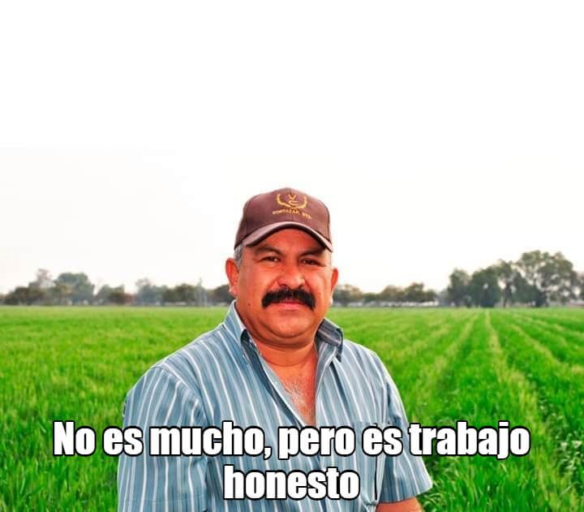

# ASIR2-ASO-PowerShell-Scripts
 
## Scripts contenidos en este repositorio:

 1. [Propiedades de un número](./script/1.md).
 2. [Operaciones sencillas](./script/2.md).
 3. [Tabla de multiplicar](./script/3.md).
 4. [Generar, ver y borrar ficheros](./script/4.md).
 5. [Media de los números introducidos por teclado](./script/5.md).
 6. [Media de los números introducidos en la llamada al script](./script/6.md).
 7. [Copiar ficheros desde/hacia directorios indicados en la llamada al script](./script/7.md).
 8. [Mostrar cadena en vertical](./script/8.md).
 9. [Pirámide de asteriscos](./script/9.md).
 10. [Cálculo de la letra de DNI](./script/10.md).
 11. [Gestion de clientes [👁👷‍♂️]](./script/11.md).
 12. [Propiedades de documentos](./script/12.md).
 13. [Calculadora gráfica](./script/13.md).
 14. [Comprobar seguridad de contraseña](./script/14.md).
 15. [Conversión de tiempo](./script/15.md).
 16. [Archivo con nombres de archivo teniendo extensión dada](./script/16.md).
 17. [Visualizar datos de red del equipo](./script/17.md).
 18. [Gestión de biblioteca con tabla hash](./script/18.md).
 19. [Gestion de clientes](./script/19.md).
 20. [Demostración de partes en funciones](./script/20.md).
 21. [Quiz de capitales [👁👷‍♂️]](./script/21.md).
 22. [Calcular coste total en base a cantidad](./script/22.md).
 99. [Comparar 3 números e indicar el mayor](./script/23.md).
 99. [Precio autobús escolar en base a número de alumnos](./script/24.md).
 99. [Transformación de unidades de temperatura](./script/25.md).
 99. [Suma de sucesión de números naturales hasta n](./script/26.md).
 99. [Listado de números encuadrados](./script/27.md).
 99. [Listado de números pares e impares hasta n](./script/28.md).
 99. [Impares desde n hasta 2](./script/29.md).
 99. [n primeros números sucesión de Fibonacci](./script/30.md).
 99. [Comparación contínua de números introducidos](./script/31.md).
 99. [Crecimiento de poblaciones](./script/32.md).

Leyenda:

 * 👁: Con interfaz gráfica
 * 👷‍♂️: Scripts no terminados

## ¿Qué esperar?

## Agradecimentos

Ejercicios facilitados por el profesorado de 2º ASIR. 

Imagen ./utils/honesto.png descargada de Internet. Se desconoce autoría. 

Lista de ComandLets facilitada por el profesorado de 2º ASIR. 

Scripts [13](./script/13.md), [14v2](./script/14.md) y [16v2](./script/16.md) cortesía de @Angelocho.

## Licencia

Esta obra se publica bajo la licenca **Creative Commons BY 2.5 ES**.

Autores y año de publicación: Pablo González y colaboradores, 2021. 

Más información en [el archivo de licencia](./license.md).